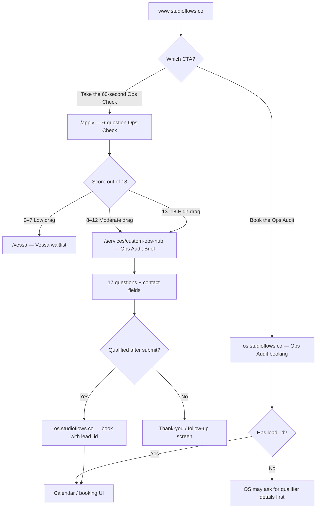

# Main Homepage Funnel — User Journey

This document describes the StudioFlows main marketing funnel on [www.studioflows.co](https://www.studioflows.co): the **60-second Ops Check** (6 questions), the **Ops Audit Brief** (17 questions), and where each path leads.

---

## Overview

Visitors can enter through two homepage CTAs:

| CTA | Label | Destination |
|-----|-------|-------------|
| **Primary (diagnostic)** | Take the 60-second Ops Check | `/apply` |
| **Secondary (high-intent)** | Book the Ops Audit | `os.studioflows.co/s/app/ops-audit/book?from=homepage-direct-book` |

Helper copy on the homepage:

> Not sure if you need help yet? Start with the Ops Check. If you already know things are messy, book the audit.

Most visitors should start with the **Ops Check**. The **Book the Ops Audit** link is for people who already know they want help and want to skip straight to scheduling (OS may still require qualifier details if no lead exists yet).

---

## User journey (flowchart)

---

## Step 1 — 60-second Ops Check (6 questions)

**Route:** `/apply`  
**Component:** `components/home/HomePreQualifierSection.js`  
**Questions:** `lib/homepage-content.ts` → `QUIZ_QUESTIONS`

**Framing copy:**
- Heading: *Find the drag before you build around it.*
- Subcopy: *Six quick questions to show where execution is leaking and whether a deeper workflow conversation makes sense.*

Each answer carries a score. Maximum possible score: **18**.

### The six questions

| # | Question | Answer options | Score |
|---|----------|----------------|-------|
| 1 | **Team size?** | 1–4 · 5–9 · 10–14 · 15–24 · 25+ | 0 · 1 · 2 · 3 · 3 |
| 2 | **Does the founder still route most handoffs and approvals?** | No · Sometimes · Yes | 0 · 2 · 3 |
| 3 | **Do sales promises regularly disappear in delivery?** | No · Occasionally · Yes | 0 · 2 · 3 |
| 4 | **Is scheduling/crew/freelancer work mostly manual?** | No · Partially · Yes | 0 · 2 · 3 |
| 5 | **Can you take a full week off without things slipping?** | Yes · Not reliably · No | 0 · 2 · 3 |
| 6 | **Where does most work currently live?** | Structured workflows · Slack + PM tools · Founder's head / ad hoc | 0 · 2 · 3 |

### Result bands

| Total score | Result title | Qualified? | Next step |
|-------------|--------------|------------|-----------|
| **13–18** | High Operational Drag | Yes | CTA: **Build your Ops Audit Brief** → `/services/custom-ops-hub` (with `src=homepage-diagnosis` and pre-qual scores in URL) |
| **8–12** | Moderate Operational Drag | Yes | Same as above |
| **0–7** | Low to Moderate Drag | No | CTA: **Join Vessa Waitlist** → `/vessa` |

Qualified users also see helper copy:

> Next step: a short Ops Audit Brief from your answers — useful even if you do not book yet. Most people finish in about 2 minutes.

They can **Retake Pre-Qualifier** from the result screen.

---

## Step 2 — Ops Audit Brief (17 questions)

**Route:** `/services/custom-ops-hub`  
**Component:** `app/services/custom-ops-hub/CustomOpsHubClient.js`

**Framing copy:**
- Title: *Build your Ops Audit Brief*
- Subtitle: *useful prep whether or not you book*
- Intro: *Answer a few quick questions and we will turn your answers into a simple brief you can use whether or not you book. Most people finish in about 2 minutes.*

If the user came from the Ops Check, a banner shows their snapshot (e.g. *Homepage Ops Check: 14/18 (high drag). This brief picks up where you left off — not a restart.*).

Most multiple-choice questions **auto-advance** on selection. Text fields require **Continue**. The final step uses **Submit brief & book the Ops Audit** (requires consent checkbox).

### The seventeen questions

Questions are shown one at a time. Sections below are for context; the UI counts **17 total steps**.

| # | Section | Question | Type | Required |
|---|---------|----------|------|----------|
| 1 | Start with how your business actually runs | **What best describes your business model?** — Service business · Agency · Consultancy · B2B SaaS · Hybrid model | Single choice | Yes |
| 2 | Start with how your business actually runs | **Which stage best matches your company right now?** — Early traction · Growing team · Scaling operations · Mature and optimizing | Single choice | Yes |
| 3 | Pinpoint where drag is costing you most | **Where is operational complexity hurting the most today?** — Client delivery · Sales to onboarding handoff · Team coordination · Reporting and visibility · Billing and fulfillment | Single choice | Yes |
| 4 | Name the bottleneck you want gone first | **What is the highest-cost bottleneck you want fixed first?** — Manual handoffs causing delays · No clear ownership per workflow stage · Fragmented tools and duplicate work · Execution quality varies by person · Leadership lacks real-time control | Single choice | Yes |
| 5 | Name the bottleneck you want gone first | **Anything to add about this bottleneck?** (optional) | Text | No |
| 6 | Show how work actually moves today | **How are you currently managing this workflow?** (select all that apply) — Spreadsheets · CRM · Project management tool · Slack and email · Manual SOPs · Custom internal tools | Multi-select | Yes |
| 7 | What breaks on repeat | **What breaks most often in your current process?** — Missed deadlines · Dropped handoffs · Rework and quality drift · Incomplete visibility · Slow decision cycles | Single choice | Yes |
| 8 | What it costs when it breaks again | **What is the business consequence when this breaks?** (typed; main free-text question) | Textarea | Yes |
| 9 | Timeline and risk if nothing changes | **What urgency window are you operating under?** — Now (0–30 days) · Near term (1–3 months) · This quarter · This year | Single choice | Yes |
| 10 | Timeline and risk if nothing changes | **What happens if this is not solved this quarter?** — Revenue risk increases · Delivery quality degrades · Hiring pressure increases · Leadership throughput slows · Strategic initiatives stall | Single choice | Yes |
| 11 | How hands-on you want us during the build | **How hands-on do you want to be during implementation?** — Low involvement (StudioFlows handles most) · Shared involvement (weekly checkpoints) · High involvement (strategy/blueprint first) | Single choice | Yes |
| 12 | Founding-member pricing | **Does founding-member pricing work for your team?** — Yes — that works for us · Yes, with a couple of questions · Need to confirm with a partner first · Not the right time | Single choice | Yes |
| 13 | Who can say yes | **Who signs off on getting started?** — Owner can approve immediately · Owner + one stakeholder · Needs team review this month · Needs quarter planning cycle | Single choice | Yes |
| 14 | Lock your details for the audit handoff | **Full name** | Text | Yes |
| 15 | Lock your details for the audit handoff | **Work email** (company email only; personal domains like Gmail are rejected) | Email | Yes |
| 16 | Lock your details for the audit handoff | **Company name** | Text | Yes |
| 17 | Lock your details for the audit handoff | **Company website** (auto-filled from email domain when possible) | URL | Yes |

### Contact / domain rules

- **Work email** must be a business domain (not Gmail, Yahoo, etc.).
- **Company website** is auto-populated from the email domain (e.g. `jane@acme.com` → `https://acme.com`) unless the user edits it.

### After submit

1. Answers are sent to `POST /api/studioflows/ingest-lead`.
2. **If qualified:** browser redirects to  
   `https://os.studioflows.co/s/app/ops-audit/book?lead_id=…&from=homepage-diagnosis` (or `ops-audit`).
3. **If not qualified:** thank-you screen with saved details and follow-up messaging (no booking redirect).

Booking is **optional but recommended** for moderate/high drag; the brief is positioned as useful even if they do not book.

---

## Direct booking path (homepage secondary CTA)

**Label:** Book the Ops Audit  
**URL:** `https://os.studioflows.co/s/app/ops-audit/book?from=homepage-direct-book`

This bypasses the marketing-site forms. If the user has **no prior lead_id**, OS may show a gate such as *We need your qualifier details before booking this audit* — meaning they still need to complete the Ops Audit Brief (or equivalent intake) before the calendar appears.

---

## Geo note

`/services/custom-ops-hub` is gated by middleware for **US and CO** traffic. Visitors from other countries are redirected to `/qualifier/us-only` with query params preserved.

---

## What this funnel is not

- **Not the Real Estate Media funnel** (`/real-estate-media`, `/real-estate-media/score`) — separate landing and score path.
- **No branded tear sheet / takeaway UI yet** — the 17Q flow is framed as building a brief; a visual takeaway component is not implemented in marketing repo today.
- **Does not redirect to consulting.studioflows.co** on the client booking handoff — qualified leads go to **os.studioflows.co**.

---

## Quick explanation (one paragraph)

A visitor lands on the homepage and either takes the **60-second Ops Check** (6 scored questions on `/apply`) or clicks **Book the Ops Audit** to go straight to OS booking. Low-drag scores go to the Vessa waitlist; moderate/high scores continue to the **Ops Audit Brief** (17 questions on `/services/custom-ops-hub`), ending with name, email, and company details. Submitting the brief ingests the lead; if qualified, they are sent to **os.studioflows.co** to book the Ops Audit. The copy is designed so “book” language only appears on paths that lead toward the calendar, and the brief is framed as useful prep—not a restart of qualification.
